# Webinar Python-ID Jogja
## Topik
Topik kita kali ini adalah **Bermain Mikrokontroler dengan menggunakan MicroPython.**
 
Materi bisa diakses di : https://s.id/kSiA7

## Pemateri
Pemateri pada topik ini akan dibawakan oleh **Ardy Seto Priambodo, S.T., M.Eng.**

## Poster

# Materi Teori
## MicroPython
MicroPython is a lean and efficient implementation of the Python 3 programming language that includes a small subset of the Python standard library and is optimised to run on microcontrollers and in constrained environments.

web: https://micropython.org/

doc: http://docs.micropython.org/en/latest/

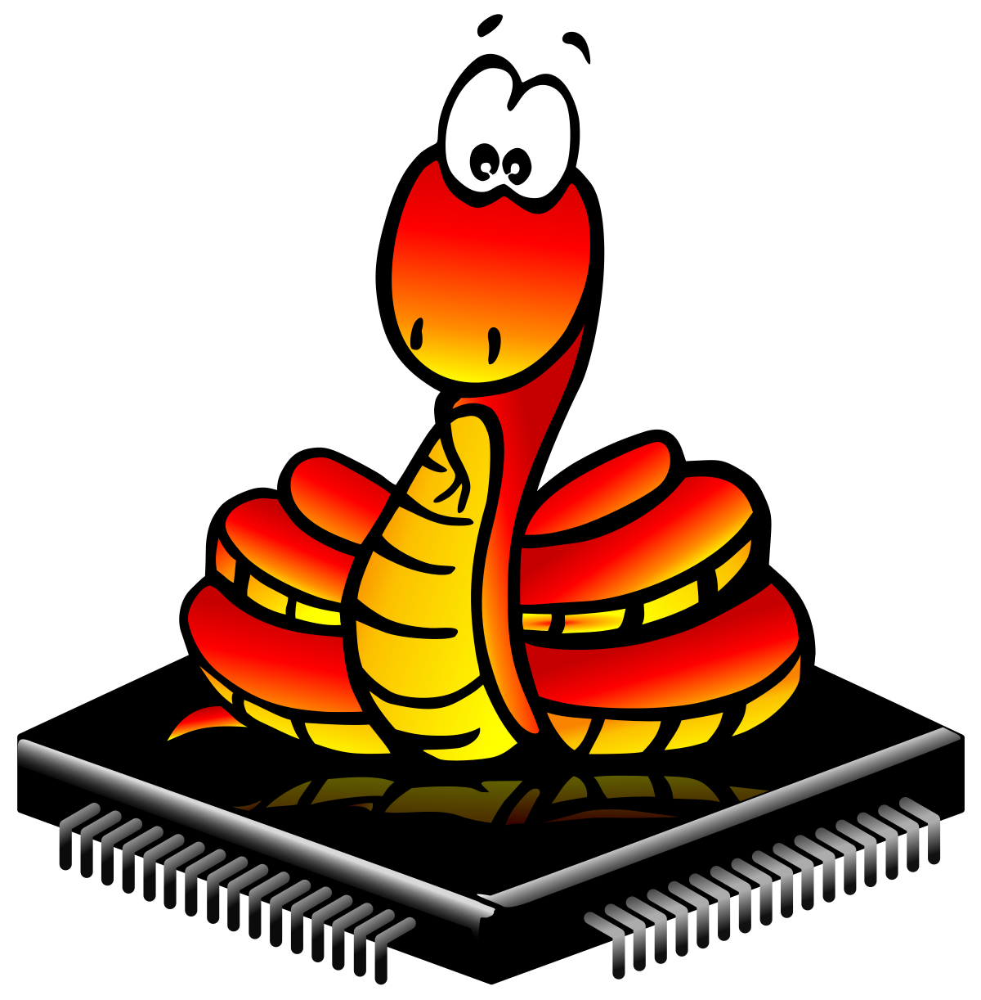
       

## Supported Board / Chip
Supported board list : https://micropython.org/download/

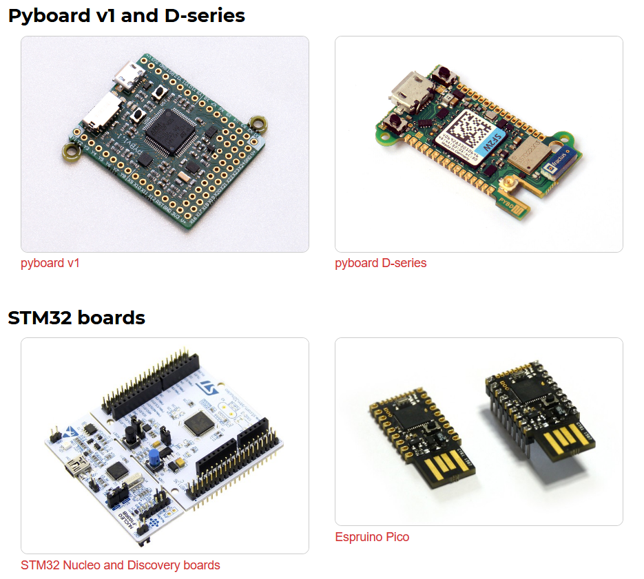

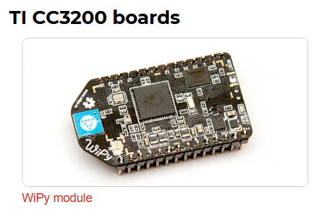

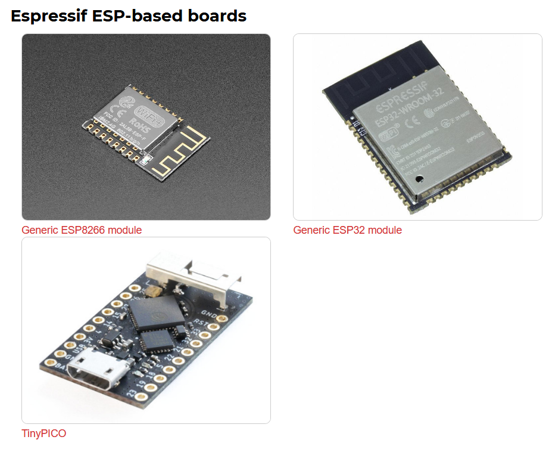

## ESP32
ESP32 is a series of low-cost, low-power system on a chip microcontrollers with integrated Wi-Fi and dual-mode Bluetooth.

web: https://www.espressif.com/en/products/socs/esp32/overview

Salah satu board yang menggunakan ESP32, lolin32 lite:

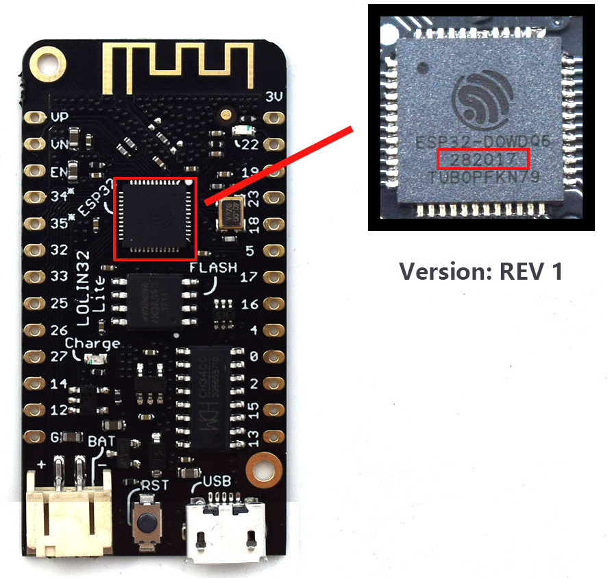

# Praktik
## Live Online
Micropython.org menyediakan live micropython secara online yang diberi nama unicorn, bisa diakses di: https://micropython.org/unicorn/

## Instalasi MicroPython ke ESP32
### Perangkat yang dibutuhkan:
 - python (saya merekomendasikan conda)
 - esptool
 - jupyter
 - ESP32
 - led RGB
 - sensor DHT11

### Instalasi Python
sumber: https://docs.conda.io/projects/conda/en/latest/user-guide/install/download.html

saya menggunakan versi minimalis yaitu Miniconda

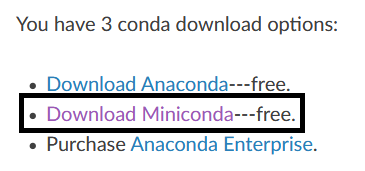

### Instalasi esptool
saya merekomendasikan membuat environment baru dan sekalian menginstall pip pada environment tersebut, untuk conda bisa ketik perintah berikut
> `> conda create --name micropython`
>
> `> conda install -c anaconda pip`

install jupyter dengan perintah:
> `> conda install -c anaconda jupyter`

install esptool dengan perintah:
> `> pip install esptool`

cek hasil instalasi dengan ketik dan akan muncul versi yang digunakan
> `> esptool`

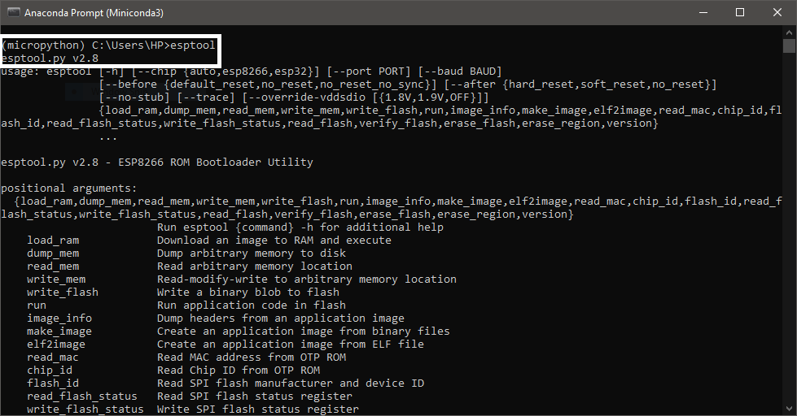

### Flash Firmware MicroPython ke ESP32
download firmware: http://micropython.org/download/esp32/

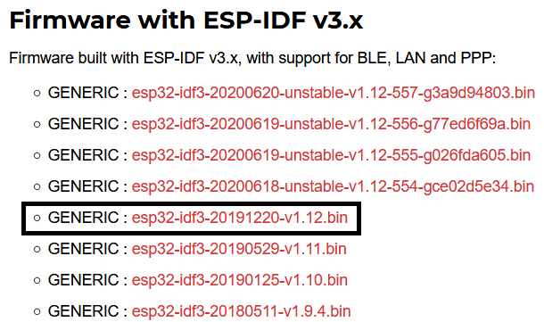

download bisa dilakukan secara manual dengan klik link atau menggunakan wget dengan perintah:

> `> wget http://micropython.org/resources/firmware/esp32-idf3-20191220-v1.12.bin`

hubungkan ESP32 dengan laptop / komputer via kabel USB dan cek COM yang terdeteksi via device manager

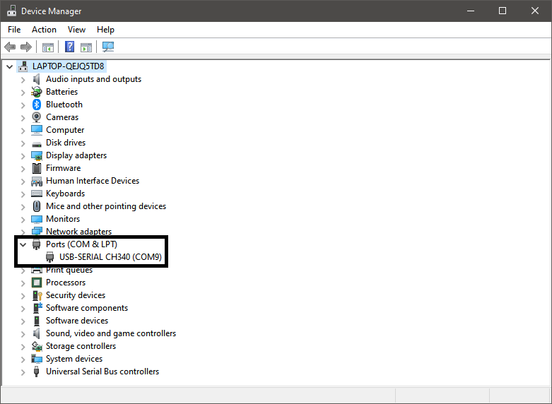

hapus firmware sebelum kita mengupgrade firmware yang lebih baru dengan mengetik:

> `> esptool.py --chip esp32 erase_flash`

kemudian flash firmware yang telah kita download dengan cara ketik (perhatikan COM yang digunakan):
> `> esptool.py --chip esp32 --port COM9 write_flash -z 0x1000 esp32-idf3-20191220-v1.12.bin`

## REPL (Read-Eval-Print Loop)
download putty: https://www.chiark.greenend.org.uk/~sgtatham/putty/latest.html

jalankan dan isi COM yang digunakan serta baudrate 115200 dan klik open untuk membuka koneksi

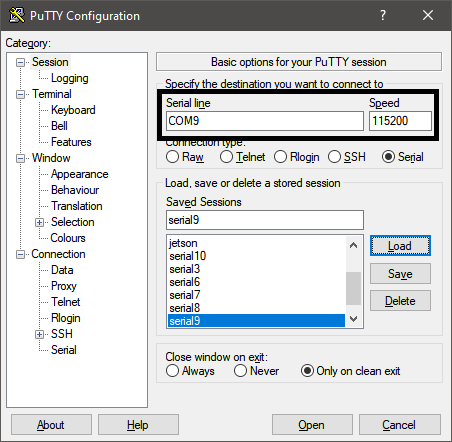

## Jupyter notebook MicroPython Kernel
install kernel pada jupyter notebook dengan mengetik:
> `> git clone https://github.com/goatchurchprime/jupyter_micropython_kernel.git`
>
> `> pip install -e jupyter_micropython_kernel`
>
> `> python -m jupyter_micropython_kernel.install`

buka jupyter notebook dengan perintah:
> `> jupyter notebook`

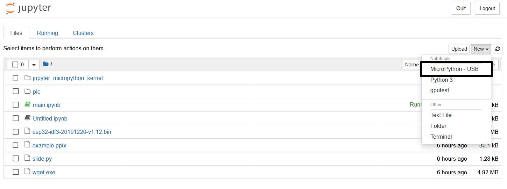