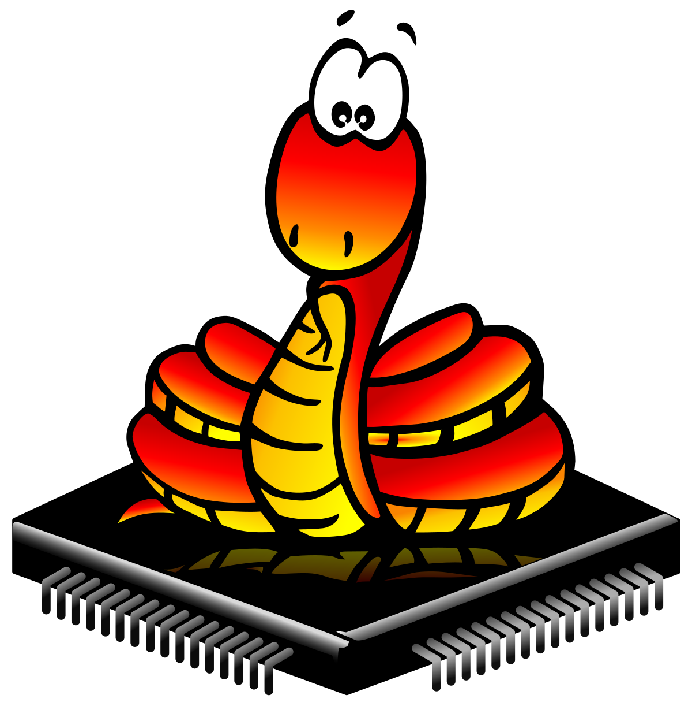
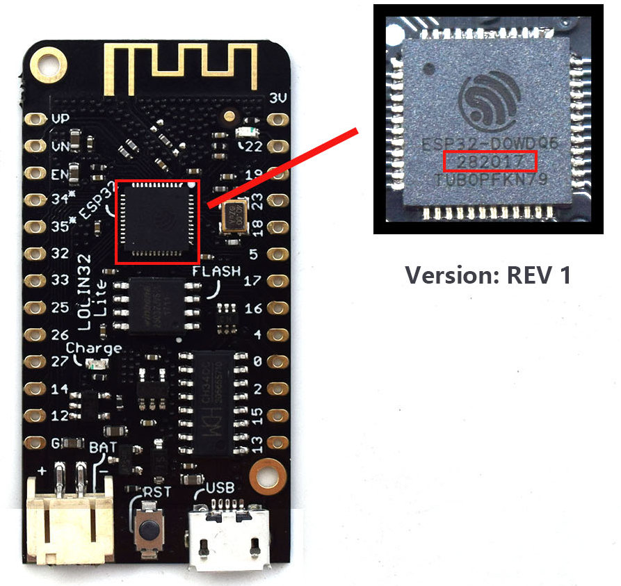
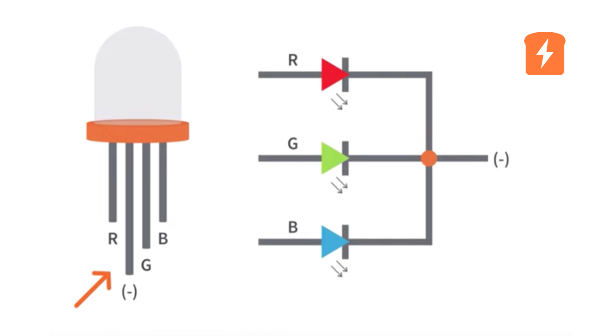
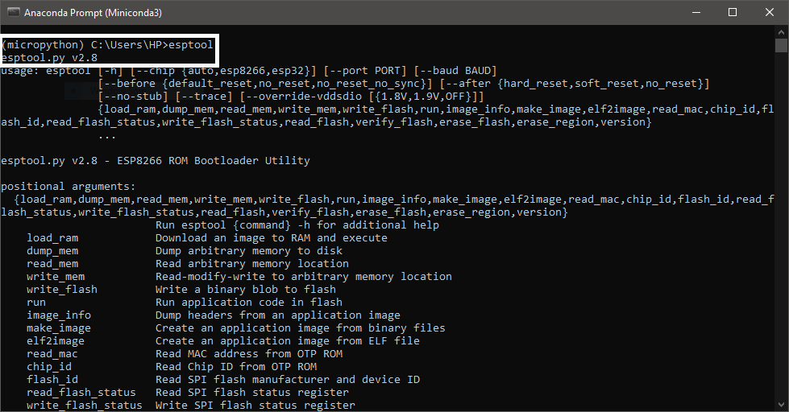
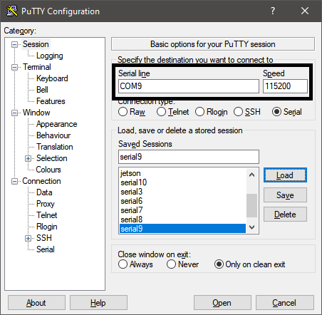
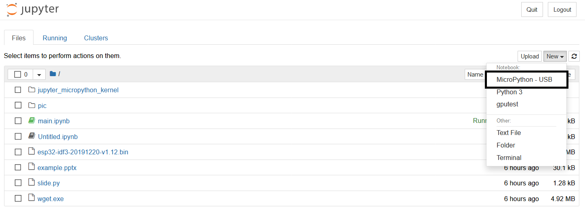
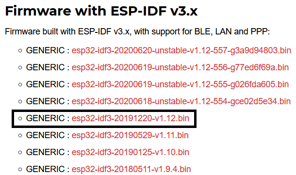
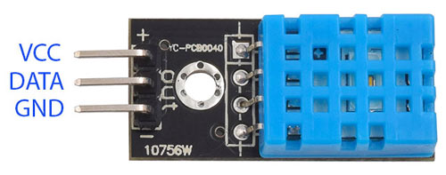
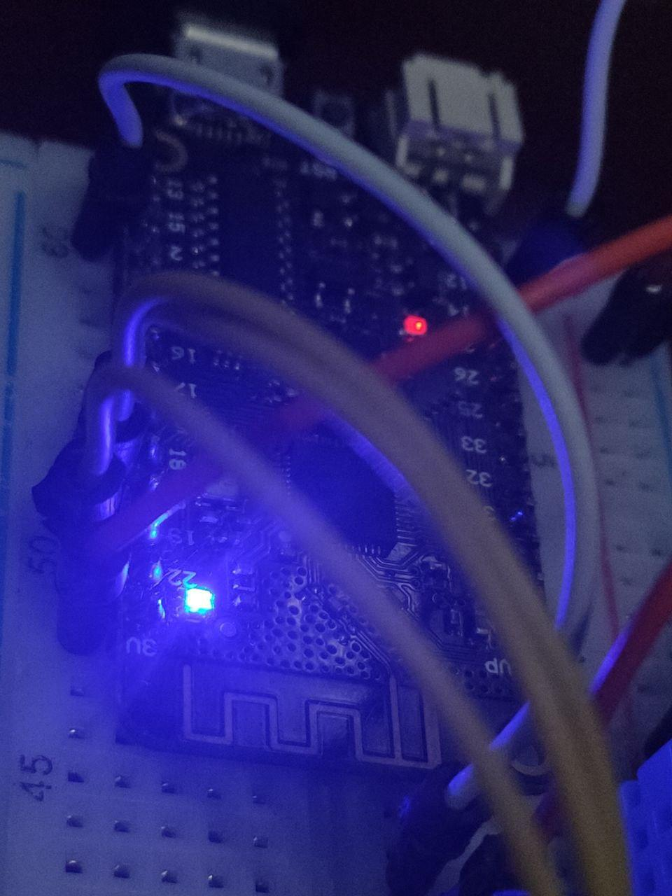

# 🐍 MicroPython on ESP32 — Workshop Materials

Welcome to the companion repository for the Python-ID Jogja community session on **MicroPython with ESP32**.

> 📅 **Event Topic**: Playing with Microcontrollers using MicroPython  
> 🎙️ **Speaker**: Ardy Seto Priambodo, S.T., M.Eng.  
> 📑 **Slides & Materials**: [Access via s.id/kSiA7](https://s.id/kSiA7)

---

## 🧠 About MicroPython

**MicroPython** is a lean and efficient implementation of Python 3 specifically designed to run on microcontrollers like the ESP8266, ESP32, STM32, and more. It brings Pythonic control to hardware devices — perfect for IoT and embedded systems development.

- 🔗 Website: [https://micropython.org](https://micropython.org)
- 📚 Documentation: [MicroPython Docs](http://docs.micropython.org/en/latest/)

<p align="center">
  
</p>

---

## 🔧 Required Hardware & Components

| Component       | Description                     |
|----------------|---------------------------------|
| ESP32 Board     | Example: LOLIN32 Lite           |
| RGB LED         | With resistor or breadboard     |
| DHT11 Sensor    | Temperature & Humidity Sensor   |
| USB Cable       | For flashing & powering ESP32   |

<p align="center">
    
  
</p>

---

## 📦 Firmware and Tools

### ✅ Flashing MicroPython to ESP32

1. **Install Miniconda (recommended)**  
   👉 [Miniconda Download](https://docs.conda.io/en/latest/miniconda.html)

2. **Set up environment:**
   ```bash
   conda create --name micropython python=3.8
   conda activate micropython
   conda install -c anaconda pip
   conda install -c anaconda jupyter
   pip install esptool
   ```

3. **Flash Firmware**

   * Download from [https://micropython.org/download/esp32/](https://micropython.org/download/esp32/)
   * Example (firmware included in `/firmware`):

     ```bash
     esptool.py --chip esp32 erase_flash
     esptool.py --chip esp32 --port COM9 write_flash -z 0x1000 firmware/esp32-idf3-20191220-v1.12.bin
     ```

<p align="center"></p>

---

## 📡 Serial Communication (REPL)

Use **PuTTY** to interact with ESP32 via REPL.

* Download: [https://www.putty.org/](https://www.putty.org/)
* Baud rate: `115200`
* COM Port: Refer to Device Manager

<p align="center"></p>

---

## 📓 Using Jupyter Notebook for MicroPython

1. Install MicroPython Kernel:

   ```bash
   git clone https://github.com/goatchurchprime/jupyter_micropython_kernel.git
   pip install -e jupyter_micropython_kernel
   python -m jupyter_micropython_kernel.install
   ```

2. Launch Notebook:

   ```bash
   jupyter notebook
   ```

<p align="center"></p>

---

## 📁 Project Structure

```
.
├── LICENSE
├── README.md
├── firmware/
│   └── esp32-idf3-20191220-v1.12.bin         # MicroPython firmware for ESP32
├── pic/                                      # All related diagrams and photos
│   ├── board-list-*.png
│   ├── lolin32-lite-*.jpg/png
│   ├── esptool.png, serial-com.png, poster.jpg, etc.
└── Project/
    ├── main.html                             # HTML presentation version
    ├── main.ipynb                            # Main Jupyter tutorial
    └── test.ipynb                            # Supplementary code
```

---

## 📷 Visual Highlights

| Firmware Flashing                 | DHT Sensor         | RGB LED Test                     |
| --------------------------------- | ------------------ | -------------------------------- |
|  |  |  |

---

## 🙋 FAQ

* **Do I need an internet connection to program ESP32 with MicroPython?**
  No, you can use serial-only interaction using USB.

* **Can I program ESP32 in a browser?**
  Yes! Try [https://micropython.org/unicorn/](https://micropython.org/unicorn/) for a live MicroPython experience.

* **How is MicroPython different from Arduino IDE?**
  MicroPython uses Python syntax and doesn't need compilation. It’s more readable and suitable for rapid prototyping.

---

## 📜 License

This repository is licensed under the [MIT License](LICENSE).

---

## ⭐ Support

If you find this repository useful:

* Star 🌟 the repo
* Share it on social media or tech communities
* Contribute via Pull Requests or Issues

---

## 👨‍🏫 Acknowledgment

This tutorial was presented as part of Python-ID Jogja webinar by:

**Ir. Ardy Seto Priambodo, S.T., M.Eng.**
📧 [2black0@gmail.com](mailto:2black0@gmail.com)